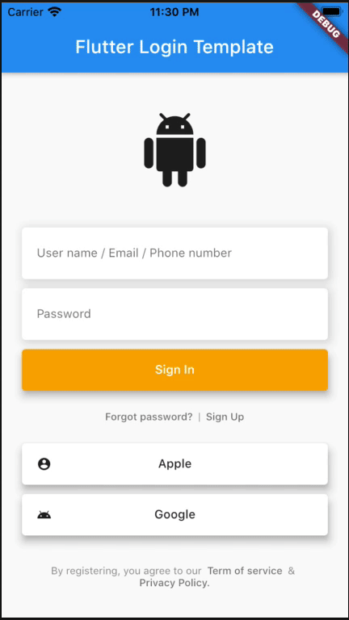

# Flutter Login Template

A Flutter package to create set of pages are used for sign in/up workflow. It will be useful for your awesome app.



## Example

The most design of Mobile Apps are same same now. Based on them, I created this package to help you to cut off many of developing time. Save them to enjoy a coffee or beer :D.

```dart
import 'package:flutter_login_template/flutter_login_template.dart';

enum _State {
  signIn,
  signUp,
  forgot,
  confirm,
  create,
}

class _MyAppState extends State<MyApp> {
  late LoginTemplateStyle style;
  _State state = _State.signIn;

  @override
  void initState() {
    style = LoginTemplateStyle.defaultTemplate;
    super.initState();
  }

  @override
  Widget build(BuildContext context) {
    var logo = Icon(
      Icons.android_rounded,
      size: 80,
    );

    var signInPage = LoginTemplateSignInPage(
      logo: logo,
      style: style,
      onPressedSignIn: () {},
      onPressedSignUp: () {
        setState(() {
          state = _State.signUp;
        });
      },
      onPressedForgot: () {
        setState(() {
          state = _State.forgot;
        });
      },
      socialButtons: [
        LoginTemplateSocialButton(
          text: 'Apple',
          onPressed: () {},
          icon: Icon(
            Icons.account_circle_sharp,
            size: 16,
            color: style.socialButtonTextStyle.color,
          ),
          style: style,
        ),
        LoginTemplateSocialButton(
          text: 'Google',
          onPressed: () {},
          icon: Icon(
            Icons.android,
            size: 16,
            color: style.socialButtonTextStyle.color,
          ),
          style: style,
        )
      ],
      term: LoginTemplateTerm(
        style: style,
        onPressedTermOfService: () {},
        onPressedPrivacyPolicy: () {},
      ),
    );

    var signUpPage = LoginTemplateSignUpPage(
      logo: logo,
      style: style,
      onPressedSignIn: () {
        setState(() {
          state = _State.signIn;
        });
      },
      onPressedSignUp: () {
        setState(() {
          state = _State.confirm;
        });
      },
      term: LoginTemplateTerm(
        style: style,
        onPressedTermOfService: () {},
        onPressedPrivacyPolicy: () {},
      ),
    );

    var forgotPasswordPage = LoginTemplateForgotPasswordPage(
        logo: logo,
        style: style,
        onPressedNext: () {
          setState(() {
            state = _State.confirm;
          });
        });

    var confirmCodePage = LoginTemplateConfirmCodePage(
      logo: logo,
      style: style,
      onPressedNext: () {
        setState(() {
          state = _State.create;
        });
      },
      onPressedResend: () {},
    );

    var createPassword = LoginTemplateCreatePasswordPage(
      logo: logo,
      style: style,
      errorTextPassword:
          'Contrary to popular belief, Lorem Ipsum is not simply random text. It has roots in a piece of classical Latin literature from 45 BC, making it over 2000 years old. Richard McClintock, a Latin professor at Hampden-Sydney College in Virginia, looked up one of the more obscure Latin words, consectetur, from a Lorem Ipsum passage, and going through the cites of the word in classical literature, discovered the undoubtable source.',
      onPressedNext: () {
        setState(() {
          state = _State.signIn;
        });
      },
    );

    Widget body;
    switch (state) {
      case _State.signUp:
        body = signUpPage;
        break;
      case _State.forgot:
        body = forgotPasswordPage;
        break;
      case _State.confirm:
        body = confirmCodePage;
        break;
      case _State.create:
        body = createPassword;
        break;
      case _State.signIn:
      default:
        body = signInPage;
        break;
    }

    return MaterialApp(
      title: 'Example',
      theme: ThemeData(
        primarySwatch: Colors.blue,
        accentColor: Colors.orangeAccent,
      ),
      home: Scaffold(
        appBar: AppBar(
          title: Text('Flutter Login Template'),
        ),
        body: SingleChildScrollView(
          child: body,
        ),
      ),
    );
  }
}
```

## Development environment

```
[✓] Flutter (Channel stable, 3.0.1, on macOS 12.3.1 21E258 darwin-x64, locale en-VN)
    • Flutter version 3.0.1 at ~/fvm/versions/stable
    • Upstream repository https://github.com/flutter/flutter.git
    • Framework revision fb57da5f94 (5 days ago), 2022-05-19 15:50:29 -0700
    • Engine revision caaafc5604
    • Dart version 2.17.1
    • DevTools version 2.12.2

[✓] Android toolchain - develop for Android devices (Android SDK version 30.0.3)
    • Android SDK at ~/Library/Android/sdk
    • Platform android-31, build-tools 30.0.3
    • ANDROID_HOME = ~/Library/Android/sdk
    • ANDROID_SDK_ROOT = ~/Library/Android/sdk
    • Java binary at: /Applications/Android Studio.app/Contents/jre/Contents/Home/bin/java
    • Java version OpenJDK Runtime Environment (build 11.0.12+0-b1504.28-7817840)
    • All Android licenses accepted.

[✓] Xcode - develop for iOS and macOS (Xcode 13.3.1)
    • Xcode at /Applications/Xcode.app/Contents/Developer
    • CocoaPods version 1.11.3

[✓] Chrome - develop for the web
    • Chrome at /Applications/Google Chrome.app/Contents/MacOS/Google Chrome

[✓] Android Studio (version 2021.2)
    • Android Studio at /Applications/Android Studio.app/Contents
    • Flutter plugin can be installed from:
      🔨 https://plugins.jetbrains.com/plugin/9212-flutter
    • Dart plugin can be installed from:
      🔨 https://plugins.jetbrains.com/plugin/6351-dart
    • Java version OpenJDK Runtime Environment (build 11.0.12+0-b1504.28-7817840)

[✓] VS Code (version 1.67.2)
    • VS Code at /Applications/Visual Studio Code.app/Contents
    • Flutter extension version 3.40.0
```

## TODO
- [ ] Animations.
- [ ] Flat design.
- [ ] Neumorphism design.
- [ ] Pin code page.
- [ ] Biometric sign in option.
- [ ] Biometric configuration page.
- [ ] User profile page.